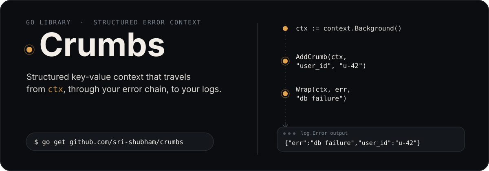
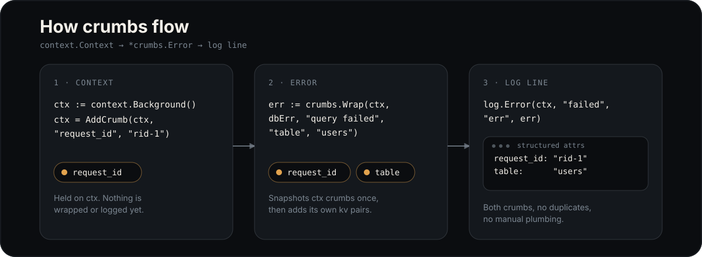

<p align="center">
  
</p>

<p align="center">
  <a href="https://goreportcard.com/report/github.com/sri-shubham/crumbs"></a>
  <a href="https://pkg.go.dev/github.com/sri-shubham/crumbs"></a>
  <a href="https://coveralls.io/github/sri-shubham/crumbs?branch=main"></a>
  
  <a href="https://github.com/sri-shubham/crumbs/stargazers"></a>
  <a href="https://github.com/sri-shubham/crumbs/issues"></a>
</p>

Crumbs attaches structured key-value data — "crumbs" — to a `context.Context`
and to the errors you wrap. Every crumb rides along the wrap chain
automatically, so the log line at the top of your call stack can carry the
full story (request ID, table, user, whatever you attached) without any
function signature threading it through by hand.

## How it flows

<p align="center">
  
</p>

- **Context crumbs are snapshotted once**, when an `*Error` is created —
  not re-read as the error bubbles up, so nothing duplicates.
- **Crumbs on the same key last-write-wins**, whether they arrive via
  `AddCrumb`, a constructor, or `.With(...)`.
- **Nothing is mutated in place** — `AddCrumb` returns a new `context.Context`
  and every accessor (`GetCrumbs`) hands back a defensive copy.

## Install

```bash
go get github.com/sri-shubham/crumbs
```

## Quick start

```go
package main

import (
	"context"
	"errors"
	"fmt"

	"github.com/sri-shubham/crumbs"
)

func main() {
	ctx := context.Background()
	ctx = crumbs.AddCrumb(ctx, "requestID", "req-12345", "userID", "user-abc")

	err := crumbs.New(ctx, "operation failed", "operation", "getData", "status", 500)
	fmt.Println(crumbs.FormatError(err, true))
	// operation failed
	// Crumbs:
	//   requestID: req-12345
	//   userID: user-abc
	//   operation: getData
	//   status: 500

	// Standard errors.Is / errors.As still work through the wrap chain.
	baseErr := errors.New("connection failed")
	wrapped := crumbs.Wrap(ctx, baseErr, "database error")
	fmt.Println(errors.Is(wrapped, baseErr)) // true
}
```

## Core concepts

**Creating and wrapping errors** — `New`/`NewError` build a fresh `*Error`;
`Wrap`/`WrapError` attach a message to an existing error while preserving
`errors.Is`/`errors.As` compatibility via `Unwrap`. Both accept trailing
key-value pairs, and `Errorf`/`Wrapf` take a format string instead:

```go
err := crumbs.New(ctx, "request failed", "status", 404, "path", "/users/123")
err = crumbs.Wrap(ctx, baseErr, "database query failed", "query", "SELECT * FROM users")
err = crumbs.Errorf(ctx, "failed with code %d", 500)
```

**Adding crumbs after the fact** — chain `.With(...)` on any `*Error`
(safe for concurrent use):

```go
err := crumbs.Errorf(ctx, "code %d", 500).With("op", "x")
```

**Reading crumbs back** — `GetCrumbs` works on both a `context.Context` and
an `*Error`; on an error it returns the full merged set (ctx crumbs +
everything added along the wrap chain):

```go
var cerr *crumbs.Error
if errors.As(err, &cerr) {
    for _, c := range cerr.GetCrumbs() {
        fmt.Printf("%s: %v\n", c.Key, c.Value)
    }
}
```

**Formatting** — `FormatError(err, includeCrumbs bool)` renders the message
chain, optionally followed by the outermost `*Error`'s crumbs.

## Logging

The first-class [`integrations/slog`](./integrations/slog) adapter extracts
crumbs from context and from any `*crumbs.Error` in the log args
automatically — no manual plumbing:

```go
import crumbslog "github.com/sri-shubham/crumbs/integrations/slog"

log := crumbslog.New(slog.New(slog.NewJSONHandler(os.Stdout, nil)))
log.Error(ctx, "operation failed", "err", err) // crumbs splatted automatically
```

`With(args...)` on the adapter works the same way: anything you pin there
still gets stringified and crumb-extracted on every subsequent call.

<details>
<summary>Wiring <code>log/slog</code> yourself, without the adapter</summary>

```go
func LogError(logger *slog.Logger, msg string, err error) {
	args := []any{"error", err}

	var cerr *crumbs.Error
	if errors.As(err, &cerr) {
		for _, c := range cerr.GetCrumbs() {
			args = append(args, slog.Any(c.Key, c.Value))
		}
	}

	logger.Error(msg, args...)
}
```

</details>

## Integrations

- **[slog adapter](./integrations/slog)** — `logger.Logger` implementation on
  top of `log/slog`.
- **[logger interface](./logger)** — the generic interface to target if you
  want to build an adapter for another logging backend.
- **[Middleware example](./examples/middleware_example)** — capture
  request-scoped metadata (request ID, user ID, path) at the edge and
  propagate it through `context.Context`.

## Examples

The [examples](./examples) directory has runnable code for basic usage,
context propagation, logging integration, standard-library `errors`
compatibility, and HTTP middleware.

## Benchmarks

Common operations stay at 1–2 allocations. Measured on Apple M1
(`go test -bench=. -benchmem`):

```
goos: darwin
goarch: arm64
pkg: github.com/sri-shubham/crumbs
cpu: Apple M1
BenchmarkErrorsNew-8                         85283263                13.82 ns/op           16 B/op           1 allocs/op
BenchmarkCrumbsNewError-8                    45591188                27.23 ns/op           80 B/op           1 allocs/op
BenchmarkCrumbsNewErrorWithCrumbs-8          22543290                56.04 ns/op          176 B/op           2 allocs/op
BenchmarkErrorsWrap-8                        14096294                82.06 ns/op           56 B/op           2 allocs/op
BenchmarkCrumbsWrapError-8                   45918513                26.96 ns/op           80 B/op           1 allocs/op
BenchmarkCrumbsWrapErrorWithCrumbs-8         21582700                55.39 ns/op          176 B/op           2 allocs/op
BenchmarkAddCrumb-8                          19820527                60.57 ns/op          104 B/op           3 allocs/op
BenchmarkAddMultipleCrumbs-8                 16305519                73.32 ns/op          168 B/op           3 allocs/op
BenchmarkGetCrumbs-8                         43355341                27.47 ns/op           96 B/op           1 allocs/op
BenchmarkFormatError-8                        4431264               271.9 ns/op           184 B/op           8 allocs/op
```

See [BENCHMARKS.md](./BENCHMARKS.md) for what each benchmark measures and
[CHANGELOG.md](./CHANGELOG.md) for release history.

## Contributing

Contributions are welcome — see [CONTRIBUTING.md](./CONTRIBUTING.md) for bug
report, pull request, and style guidelines.

## License

[MIT License](./LICENSE) — Copyright (c) 2025 Shubham Srivastava
